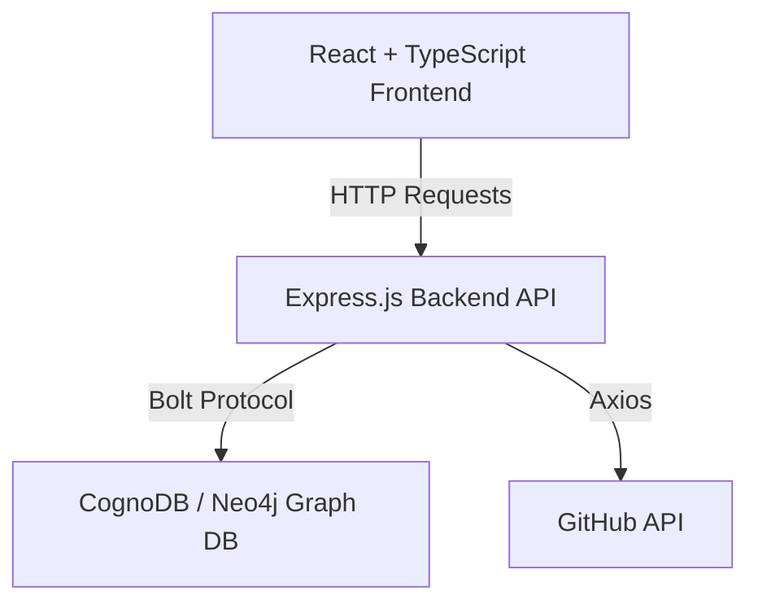
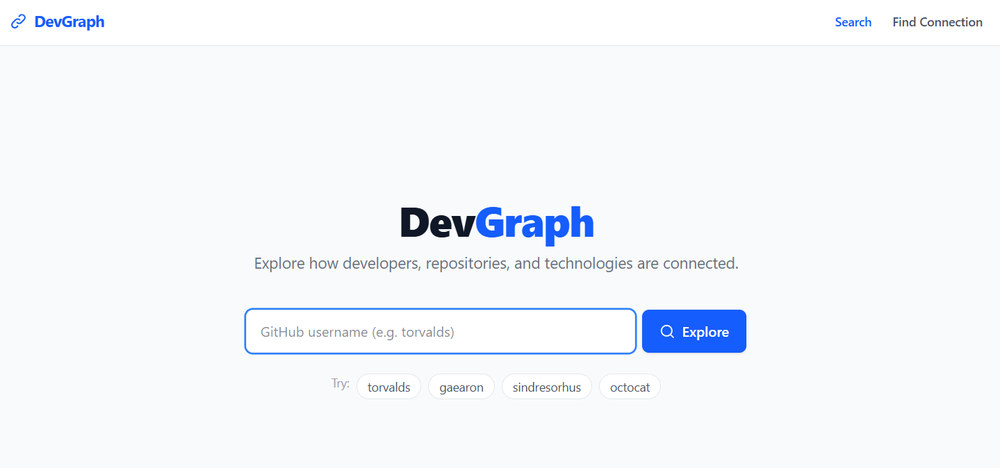
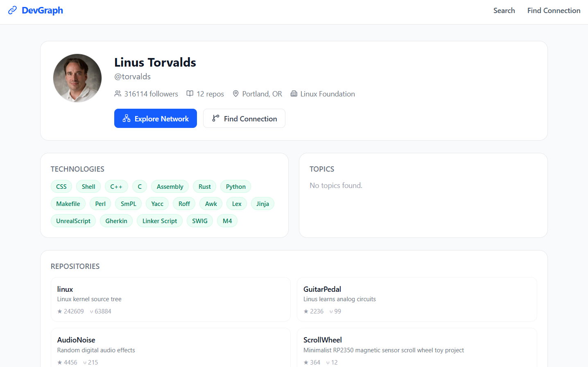
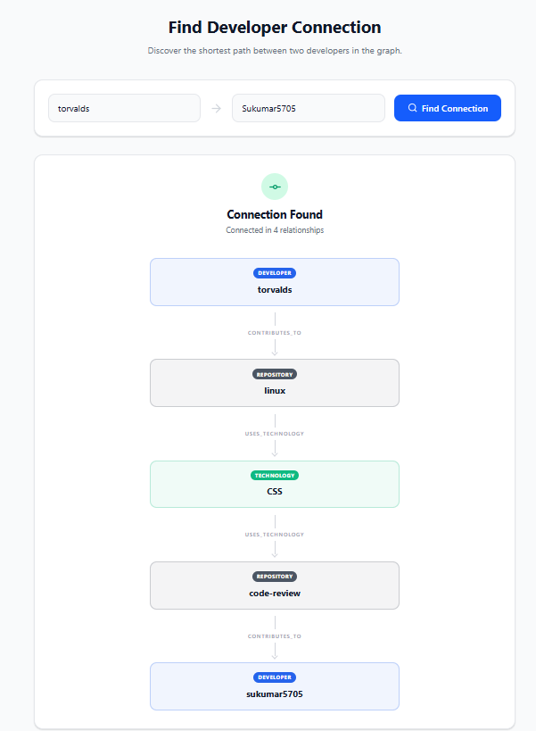
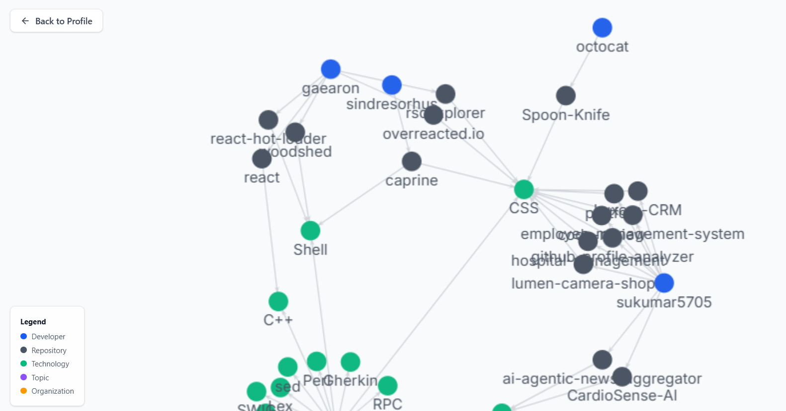

# DevGraph

Developer Collaboration & Technology Discovery

Live Demo: [https://devgraph-cognodb.vercel.app/](https://devgraph-cognodb.vercel.app/)  
Repository: [https://github.com/Sukumar5705/devgraph-cognodb](https://github.com/Sukumar5705/devgraph-cognodb)  
Demo Video: [https://drive.google.com/file/d/1pQ2a9MMFze8L8nwYpeDoKwCNesrSHW3P/view?usp=sharing](https://drive.google.com/file/d/1pQ2a9MMFze8L8nwYpeDoKwCNesrSHW3P/view?usp=sharing)  

## Overview

DevGraph is a developer collaboration and technology discovery platform designed to explore how developers, repositories, technologies, organizations, and topics connect. By modeling GitHub's rich metadata network inside a graph database, DevGraph reveals multi-hop relationship paths, shared technological ecosystems, and developer affinity groups that would be more cumbersome to express using traditional relational schemas, especially for multi-hop and variable-depth traversal.

## Why a Graph Database?

Relational databases represent tables and join records. While they can model developer connections via intermediate tables (e.g. `DeveloperRepository`, `RepositoryTechnology`, `RepositoryTopic`), querying relationships that span multiple hops becomes a massive performance bottleneck.

For example, asking: *"Which developers are connected to Developer A by contributing to repositories that use the same technologies?"* requires:
1. Joining `Developer` to `DeveloperRepository`
2. Joining to `Repository`
3. Joining to `RepositoryTechnology`
4. Joining to `Technology`
5. Joining back down through the same tables for other developers

At scale, recursive multi-join queries lead to runaway computational complexity. Graph databases like CognoDB (Neo4j-compatible) treat relationships as first-class citizens. Relationships are stored as direct physical pointers (edges) in the database. This allows path-based queries (like graph expansions or `shortestPath` traversals) to be executed in O(k) time relative to the path depth rather than the total size of the tables, making multi-hop traversal extremely efficient.

## Key Features

- **Interactive Force-Directed Graph**: Visually traverse the network of developers, repositories, technologies, topics, and organizations.
- **On-Demand Profile Ingestion**: Fetch, map, and merge any public GitHub developer's profile and repositories on-the-fly.
- **Explainable Connection Paths**: Discover precisely *why* two entities are related by displaying the explicit path of shared technologies, topics, or organizations.
- **Developer-to-Developer Connections**: Locate the shortest path connecting any two developers within the explored ecosystem.
- **Shortest Path to Tech**: Find the exact sequence of repositories and contributors connecting a developer to a specific technology.

## How DevGraph Works

1. **User Search**: The user enters a GitHub username.
2. **Database Lookup**: The backend queries CognoDB. If the developer exists, the cached profile and network are served immediately.
3. **On-Demand Ingestion**: If the developer does not exist, the backend fetches profile, repository, and language details directly from the GitHub API, parses them, and executes Cypher statements to merge the new nodes and edges into the graph.
4. **Network Expansion**: In the browser, the developer's network is displayed as an interactive force-directed graph. Users can double-click nodes to dynamically expand the graph further.

## Graph Data Model

### Nodes

- **Developer** (`Developer`)
  - `username` (Unique string key, normalized)
  - `name` (String)
  - `avatarUrl` (String)
  - `bio` (String)
  - `location` (String)
  - `company` (String)
  - `followers` (Integer)
  - `publicRepos` (Integer)
- **Repository** (`Repository`)
  - `fullName` (Unique string key)
  - `name` (String)
  - `ownerUsername` (String)
  - `description` (String)
  - `url` (String)
  - `stars` (Integer)
  - `forks` (Integer)
  - `watchers` (Integer)
  - `openIssues` (Integer)
  - `defaultBranch` (String)
  - `isFork` (Boolean)
  - `createdAt` (String)
  - `updatedAt` (String)
- **Technology** (`Technology`)
  - `name` (String)
  - `normalizedName` (Unique string key)
- **Topic** (`Topic`)
  - `name` (String)
  - `normalizedName` (Unique string key)
- **Organization** (`Organization`)
  - `login` (Unique string key)
  - `name` (String)

### Relationships

- `(Developer)-[:CONTRIBUTES_TO]->(Repository)`
- `(Repository)-[:USES_TECHNOLOGY]->(Technology)`
- `(Repository)-[:HAS_TOPIC]->(Topic)`
- `(Developer)-[:MEMBER_OF]->(Organization)`
- `(Repository)-[:OWNED_BY]->(Organization)`

## Architecture



- **Frontend**: React 19, Vite, TypeScript, Tailwind CSS, and `react-force-graph-2d` for interactive canvas visualization.
- **Backend**: Node.js, Express.js, and the official `neo4j-driver` using high-speed Bolt protocol connection pooling.
- **Database**: CognoDB (Neo4j-compatible managed graph database).

## Key Cypher Queries

### 1. Multi-Hop Related Developer Search (by Technology affinity)

Finds other developers who contribute to repositories using the same technologies as the target developer, sorted by shared technology count.

```cypher
MATCH (d:Developer {username: $username})
      -[:CONTRIBUTES_TO]->(:Repository)
      -[:USES_TECHNOLOGY]->(t:Technology)
      <-[:USES_TECHNOLOGY]-(:Repository)
      <-[:CONTRIBUTES_TO]-(other:Developer)
WHERE other.username <> $username
WITH other, collect(DISTINCT t.name) AS sharedTechnologies
RETURN other.username AS username,
       other.name AS name,
       other.avatarUrl AS avatarUrl,
       sharedTechnologies,
       size(sharedTechnologies) AS sharedCount
ORDER BY sharedCount DESC
LIMIT $limit
```

### 2. Bounded Shortest Path

Finds the shortest path of relationships (up to 6 hops) connecting two developers.

```cypher
MATCH (a:Developer {username: $from}),
      (b:Developer {username: $to})
MATCH p = shortestPath((a)-[*1..6]-(b))
RETURN p
LIMIT 1
```

## Explainable Connections

Rather than showing abstract match scores, DevGraph tracks and highlights the exact evidence connecting nodes. When two developers are connected, the system renders the specific path of shared technologies, repositories, topics, and organizations.

Every step in the path is backed by concrete data:
- **Developer A** contributed to **Repository X**
- **Repository X** uses **Technology Y**
- **Repository Z** also uses **Technology Y**
- **Developer B** contributed to **Repository Z**

This allows users to inspect the exact engineering context behind any connection.

## On-Demand GitHub Ingestion

If a searched developer does not exist in the graph, DevGraph executes a transaction to ingest data:
1. Fetches GitHub user profile.
2. Fetches their public repositories.
3. For each repository, queries GitHub for primary programming languages and topics.
4. Performs a single optimized transaction in CognoDB to merge the `Developer`, `Repository`, `Technology`, `Topic`, and `Organization` nodes along with their respective relationships.

## Tech Stack

- **Frontend**:
  - React 19
  - TypeScript
  - Tailwind CSS
  - Lucide React (Icons)
  - `react-force-graph-2d` (HTML5 Canvas network visualizer)
- **Backend**:
  - Node.js (ES Modules)
  - Express.js
  - `neo4j-driver` (database driver)
  - Axios (HTTP client)
  - Winston (Logging)

## Setup

### 1. Database Credentials
Ensure you have a running Neo4j-compatible or CognoDB instance. Set up a `.env` file in the `backend/` directory based on `.env.example`.

### 2. Installing Dependencies
Install backend dependencies:
```bash
cd backend
npm install
```

Install frontend dependencies:
```bash
cd ../frontend
npm install
```

### 3. Run Locally
Start the backend server (runs on port 5000):
```bash
cd backend
npm run dev
```

Start the frontend development server:
```bash
cd ../frontend
npm run dev
```

## Seed Data

To seed the database with initial developer profiles (e.g. `torvalds`, `gaearon`, `sindresorhus`):

```bash
cd backend
npm run seed
```
This executes the full ingestion pipeline:
1. `npm run fetch` fetches public profile metadata from GitHub and saves it locally.
2. `npm run seed:load` reads the fetched metadata and merges it into CognoDB.
3. `npm run verify` runs verification queries to assert that the database nodes and links match expected counts.

## API

All endpoints return a JSON payload with `{ success: true, data: ... }`.

### 1. Developer Endpoints
- `GET /api/developers/:username`
  Returns the complete developer profile, repositories, topics, and technologies.
- `GET /api/developers/:username/network`
  Returns the graph visualization payload (nodes and edges) centered around the developer.
- `GET /api/developers/:username/connections`
  Returns a list of related developers, grouped and ranked by shared technologies, topics, and organizations.

### 2. Path Endpoints
- `GET /api/connections`
  QueryParams: `from` (username), `to` (username/technology name).
  Returns the shortest path connecting the two entities.

### 3. Technology Endpoints
- `GET /api/technologies/:name`
  Returns community statistics and listings of developers/repositories using the target technology.

### 4. Health Check
- `GET /api/health`
  Returns connection status of the backend database.

## Security & Engineering

- **CORS Config**: CORS origins are configurable in production using the `FRONTEND_URL` environment variable, preventing arbitrary web clients from calling internal APIs.
- **Safe Error Handling**: Stack traces and database credentials are caught at the controller/middleware level and masked from responses, preventing accidental information disclosure.
- **Parameterization**: All Cypher statements are fully parameterized to protect against Cypher Injection.

## Limitations

- **GitHub Rate Limits**: Standard unauthenticated calls to GitHub are subject to rate limiting. Provide `GITHUB_TOKEN` in `backend/.env` to ingest larger profiles.
- **Bounded Path Search**: Shortest path traversals are capped at 6 hops to protect database query performance.

## Screenshots

### Search Home



### Developer Network Explorer



### Path Connections Finder



### Technology Communities


